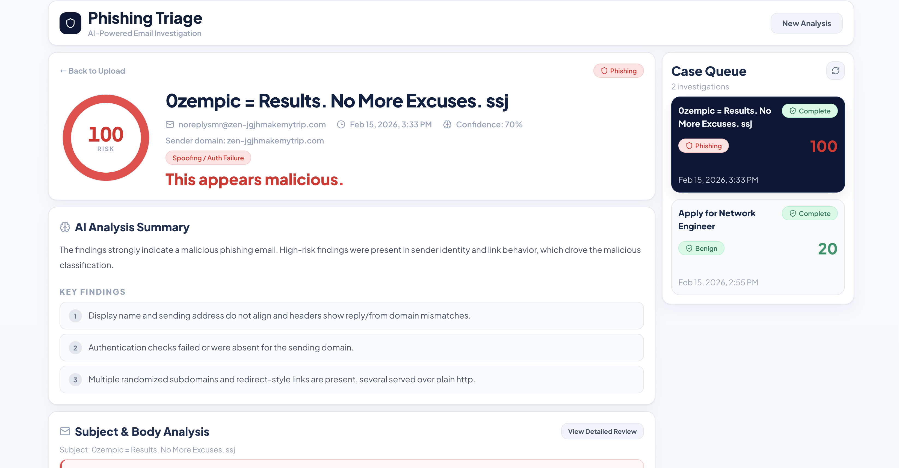
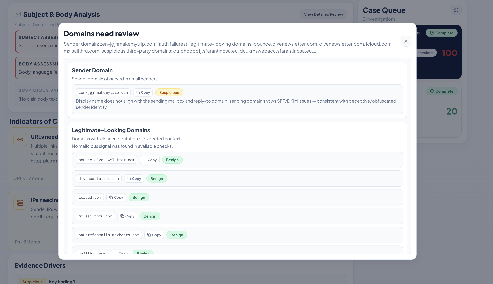

# Phishing Triage Agent

Evidence-first phishing triage for `.eml` messages using deterministic scoring, bounded LLM semantics, adaptive threat-intel enrichment, and a local Docker Web UI.

## Why This Project
Most email triage tools are either too static (rules-only) or too opaque (LLM-only). This system is designed to be:
- **Deterministic at verdict time**: final risk/verdict come from the scoring engine, not free-form model output.
- **LLM-bounded**: models are used for semantic assessments and concise copy only.
- **Audit-ready**: every stage writes structured artifacts for traceability.
- **Operationally practical**: local Docker runtime, case queue, analyst decision workflow.

## Core Capabilities
- `.eml` normalization into a stable envelope schema.
- Deterministic signal generation across identity/auth/URL/content/attachment/evasion categories.
- Adaptive enrichment routing from unresolved non-deterministic signals.
- Threat-intel-grounded semantic reassessment with anti-contradiction guardrails.
- Deterministic threat tagging with a single primary label.
- Analyst-focused report payload powering the Web UI.

## Architecture (Current Runtime)

```mermaid
%%{init: {
  "theme": "base",
  "themeVariables": {
    "background": "#F8FAFC",
    "primaryColor": "#E8F0FE",
    "primaryTextColor": "#0F172A",
    "primaryBorderColor": "#BFD3F6",
    "lineColor": "#6B7280",
    "secondaryColor": "#EEF2FF",
    "tertiaryColor": "#F1F5F9",
    "clusterBkg": "#F8FAFC",
    "clusterBorder": "#D6E3FA"
  }
}}%%
flowchart LR
    U["Upload .eml"] --> API["FastAPI: /api/cases"]
    API --> STORE["CaseStore\nSQLite + artifact paths"]
    API --> RUNNER["Background Case Runner"]

    subgraph CORE["Investigation Core"]
      NORM["Normalization\nsrc/Ingestion/intake.py"]
      SIG["Signal Engine (deterministic)\nSignal_Engine/signal_engine.py"]
      SCORE0["Baseline Scoring\nScoring_Engine/scoring_engine.py"]
      PLAN["Adaptive Enrichment Selection\nInvestigation_Agent/investigation_pipeline.py"]
      MCP["MCP Router + IOC Cache\nMCP_Adapters/mcp_router.py"]
      SEM["Semantic Reassessment\nSignal_Engine/semantic_signal_assessor.py"]
      LOOP["Bounded Adaptive Loop\n(early-stop + gate checks)"]
      SCOREF["Final Scoring + Primary Threat Tag\nInvestigation_Agent/threat_tags.py"]
      REP["Web Report Builder\nwebui/report_builder.py"]
    end

    RUNNER --> NORM --> SIG --> SCORE0 --> PLAN --> MCP --> SEM --> LOOP --> SCOREF --> REP
    REP --> STORE

    STORE --> SSE["SSE Event Stream\n/api/cases/{id}/events"]
    SSE --> UI["React Web UI\nwebui/frontend/src/App.jsx"]

    classDef compute fill:#EEF6FF,stroke:#B6CDF5,color:#0F172A;
    classDef edge fill:#F2F8FF,stroke:#C3D9FA,color:#0F172A;
    class NORM,SIG,SCORE0,PLAN,MCP,SEM,LOOP,SCOREF,REP compute;
    class API,STORE,RUNNER,SSE,UI,U edge;
```



## Security and Trust Model
- Email payload is treated as **untrusted input** end-to-end.
- Prompt-injection prechecks + schema-constrained LLM outputs.
- Semantic outputs cannot directly set final verdict.
- Deterministic scorer remains the verdict authority.
- Runtime case data (`webui/data/`) is gitignored and scrub-safe.

## UI Preview

### Main Investigation Workspace


### IOC Analysis Feature


## Quick Start

### Prerequisites
- Docker Desktop
- `docker compose`

### Configure Environment
1. Copy the template:
```bash
cp .env.example .env
```
2. Choose runtime mode in `.env`:
   - `INVESTIGATION_MODE=mock` for local/offline-friendly workflow
   - `INVESTIGATION_MODE=live` for external threat-intel lookups
3. Add API keys based on the table below.

### API Keys and Vendors
| Env Var | Vendor | Required | Used For |
|---|---|---:|---|
| `OPENAI_API_KEY` | OpenAI | Recommended | Semantic signal assessment + report text generation. Without it, pipeline falls back to deterministic heuristics. |
| `VT_API_KEY` | VirusTotal | Optional (`live`) | URL/file/hash reputation checks in enrichment. |
| `URLSCAN_API_KEY` | urlscan.io | Optional (`live`) | URL detonation/submission + scan polling. |
| `ABUSEIPDB_API_KEY` | AbuseIPDB | Optional (`live`) | IP reputation and abuse confidence context. |
| `OTX_API_KEY` | AlienVault OTX | Optional (`live`) | Additional indicator reputation/correlation context. |
| `URLHAUS_AUTH_KEY` | URLhaus | Optional (`live`) | Supplemental malicious URL intel where available. |
| `CUCKOO_API_TOKEN` | CAPE/Cuckoo (self-hosted) | Optional (`live`) (TURNED OFF) | Sandbox detonation for attachment/URL workflows if CAPE/Cuckoo is enabled. |

Notes:
- For quickest setup, `mock` mode + `OPENAI_API_KEY` is enough to run the full UI workflow.
- `live` mode is designed to run even if some enrichment keys are missing; unavailable providers are skipped/deferred.
- Keep secrets only in `.env` (already gitignored). Never commit real keys.

### Run
```bash
docker compose up --build
```

Open:
- `http://localhost:8080`

Stop:
```bash
docker compose down
```

## Local Development

### CLI
Interactive:
```bash
python3 cli/phishscan.py
```

One-shot:
```bash
python3 Investigation_Agent/investigation_pipeline.py \
  --eml /absolute/path/to/email.eml \
  --out-dir /absolute/path/to/output_dir \
  --mode mock
```

## Output Artifacts
For each case run, the pipeline emits structured artifacts including:
- `envelope.json`
- `signals.baseline.json`, `signals.final.json`
- `score.baseline.json`, `score.final.json`
- `semantic_assessment.json`
- `report.final.json`
- `investigation_result.json`
- `audit_chain.json`, `audit_chain.md`

## Repository Structure
- `src/Ingestion/` — `.eml` parsing and normalization
- `Signal_Engine/` — deterministic + semantic signal logic
- `Scoring_Engine/` — deterministic risk/confidence scoring
- `Investigation_Agent/` — adaptive orchestration and threat tags
- `MCP_Adapters/` — enrichment routing, tool contracts, IOC cache
- `webui/` — FastAPI app, case store, runner, report builder
- `webui/frontend/` — React UI (JSX + Tailwind)
- `Docs/` — component pipeline documentation

## Documentation Map
- Normalization: `Docs/normalization/normalization_pipeline.md`
- Signals: `Docs/signals/signal_engine_pipeline.md`
- Semantic Assessor: `Docs/signals/semantic_signal_assessor.md`
- Scoring: `Docs/scoring/scoring_engine_pipeline.md`
- Investigation: `Docs/investigation/investigation_agent_pipeline.md`
- Threat Tagging: `Docs/investigation/threat_tagging_pipeline.md`
- Web UI: `Docs/webui/local_webui_pipeline.md`
- MCP Tooling/Cache: `Docs/mcp/mcp_tooling_and_cache.md`
- Confidence Gate: `Docs/gating/confidence_gate_and_pivot.md`
- Prompt Contracts: `Docs/prompts/prompt_contracts.md`

## Testing
```bash
python3 -m unittest discover -s tests -p 'test_*.py'
```

## Privacy and Repo Hygiene
- Runtime cases and uploads are excluded by `.gitignore`:
  - `webui/data/cases/`
  - `webui/data/uploads/`
  - `webui/data/*.db`
- `.env` is excluded; only `.env.example` is tracked.
