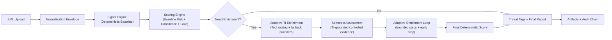

# Phishing Triage Agent (IN DEV)

Evidence-first phishing triage from a single `.eml` file with deterministic scoring, bounded semantic LLM analysis, and a local Docker Web UI.

## Current Direction
- Web UI is the primary runtime (`docker compose up --build`).
- Playbook orchestration is deprecated.
- Investigation now uses adaptive deterministic enrichment-tool routing from unresolved non-deterministic signals.
- LLM is constrained to semantic analysis + concise analyst copy, not tool execution or direct verdict control.

## Architecture Summary
Pipeline stages:
1. Parse + normalize `.eml` into envelope JSON.
2. Generate deterministic signals.
3. Score baseline risk/confidence deterministically.
4. Execute baseline TI enrichment on highest-value unresolved signals.
5. Run semantic LLM assessment on TI-grounded controlled evidence.
6. Continue adaptive bounded enrichment and rescore each iteration.
7. Derive deterministic threat tags from final signals/score.
8. Emit final verdict, report, and audit artifacts.



## Key Components
- Ingestion/Normalization: `/Users/gabe/Documents/Phishing_Triage_Agent_Mailbbox_Plug- in/src/Ingestion/intake.py`
- Signal Engine: `/Users/gabe/Documents/Phishing_Triage_Agent_Mailbbox_Plug- in/Signal_Engine/signal_engine.py`
- Semantic Assessor: `/Users/gabe/Documents/Phishing_Triage_Agent_Mailbbox_Plug- in/Signal_Engine/semantic_signal_assessor.py`
- Scoring Engine: `/Users/gabe/Documents/Phishing_Triage_Agent_Mailbbox_Plug- in/Scoring_Engine/scoring_engine.py`
- Investigation Orchestrator: `/Users/gabe/Documents/Phishing_Triage_Agent_Mailbbox_Plug- in/Investigation_Agent/investigation_pipeline.py`
- MCP Router + Cache: `/Users/gabe/Documents/Phishing_Triage_Agent_Mailbbox_Plug- in/MCP_Adapters/mcp_router.py`
- Local Web UI: `/Users/gabe/Documents/Phishing_Triage_Agent_Mailbbox_Plug- in/webui/`

## Docs
- Normalization: `/Users/gabe/Documents/Phishing_Triage_Agent_Mailbbox_Plug- in/Docs/normalization/normalization_pipeline.md`
- Signals: `/Users/gabe/Documents/Phishing_Triage_Agent_Mailbbox_Plug- in/Docs/signals/signal_engine_pipeline.md`
- Semantic assessor: `/Users/gabe/Documents/Phishing_Triage_Agent_Mailbbox_Plug- in/Docs/signals/semantic_signal_assessor.md`
- Scoring: `/Users/gabe/Documents/Phishing_Triage_Agent_Mailbbox_Plug- in/Docs/scoring/scoring_engine_pipeline.md`
- Investigation pipeline: `/Users/gabe/Documents/Phishing_Triage_Agent_Mailbbox_Plug- in/Docs/investigation/investigation_agent_pipeline.md`
- Threat tagging: `/Users/gabe/Documents/Phishing_Triage_Agent_Mailbbox_Plug- in/Docs/investigation/threat_tagging_pipeline.md`
- Web UI: `/Users/gabe/Documents/Phishing_Triage_Agent_Mailbbox_Plug- in/Docs/webui/local_webui_pipeline.md`
- Audit chain: `/Users/gabe/Documents/Phishing_Triage_Agent_Mailbbox_Plug- in/Docs/investigation/audit_chain.md`
- Prompt contracts (active): `/Users/gabe/Documents/Phishing_Triage_Agent_Mailbbox_Plug- in/Docs/prompts/prompt_contracts.md`

## Legacy Docs
- Historical engineering plan (reference only): `/Users/gabe/Documents/Phishing_Triage_Agent_Mailbbox_Plug- in/Docs/phishing_agent_engineering_report.md`

## Web UI (Docker)
Run:
```bash
docker compose up --build
```

Open:
- `http://localhost:8080`

UI highlights:
- JSX React frontend (Vite + Tailwind) served by FastAPI from `webui/frontend/dist`,
- production-style split view (report workspace + sticky case queue),
- persistent `New Analysis` and `Back to Upload` actions for repeat investigations,
- report hero with animated risk ring, sender/date/confidence metadata row, verdict badge, and deterministic threat-tag chips,
- fixed-height queue cards with line-clamped subjects and risk-color alignment to verdict,
- `Indicators of Compromise` cards with grouped modal drill-down + full IOC copy,
- targeted semantic IOC overrides (no blanket “all suspicious” promotion),
- `View Detailed Review` modal with semantic rationale and sandboxed snippet evidence,
- neutral gray attachment card when no files are present (`No attachments found`).

Frontend source:
- `/Users/gabe/Documents/Phishing_Triage_Agent_Mailbbox_Plug- in/webui/frontend/src/App.jsx`
- `/Users/gabe/Documents/Phishing_Triage_Agent_Mailbbox_Plug- in/webui/frontend/src/index.css`

Stop:
```bash
docker compose down
```

## CLI (Optional)
Interactive:
```bash
python3 /Users/gabe/Documents/Phishing_Triage_Agent_Mailbbox_Plug- in/cli/phishscan.py
```

One-shot:
```bash
python3 /Users/gabe/Documents/Phishing_Triage_Agent_Mailbbox_Plug- in/Investigation_Agent/investigation_pipeline.py \
  --eml /absolute/path/to/email.eml \
  --out-dir /absolute/path/to/output_dir \
  --mode mock
```

## Notes
- Semantic analysis is schema-constrained and prompt-injection hardened.
- Final verdict remains deterministic and evidence-backed.
- Existing `Playbooks/` files remain in repo for reference, but orchestration no longer depends on them.
